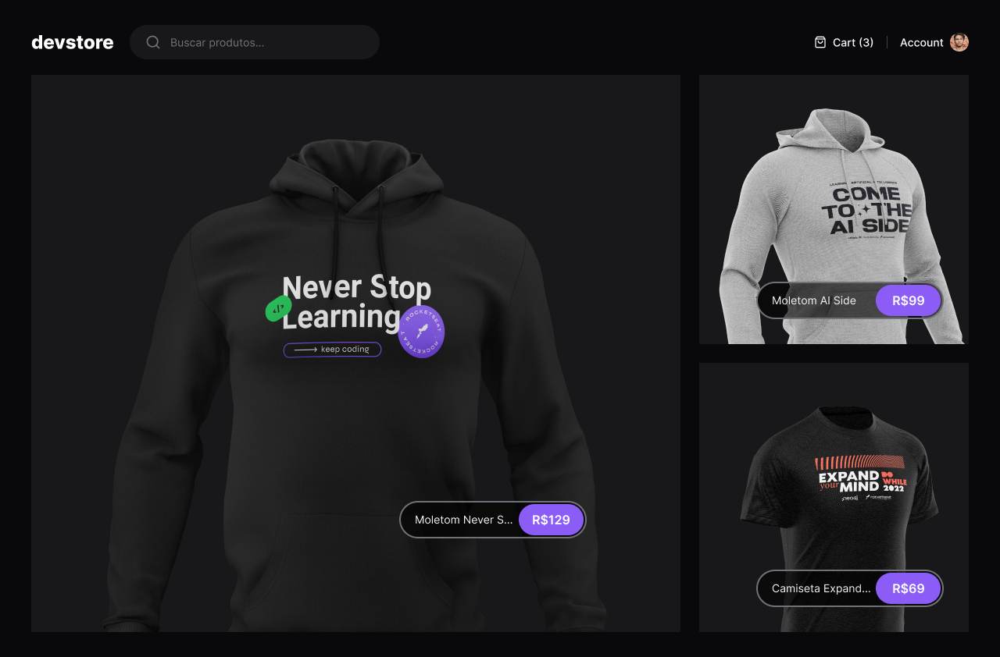
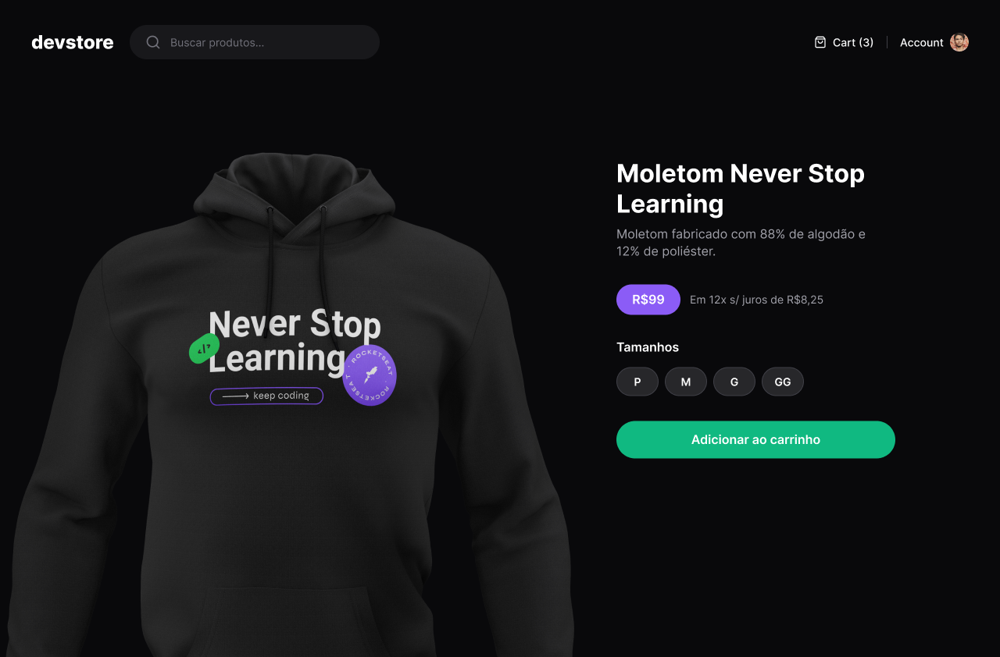
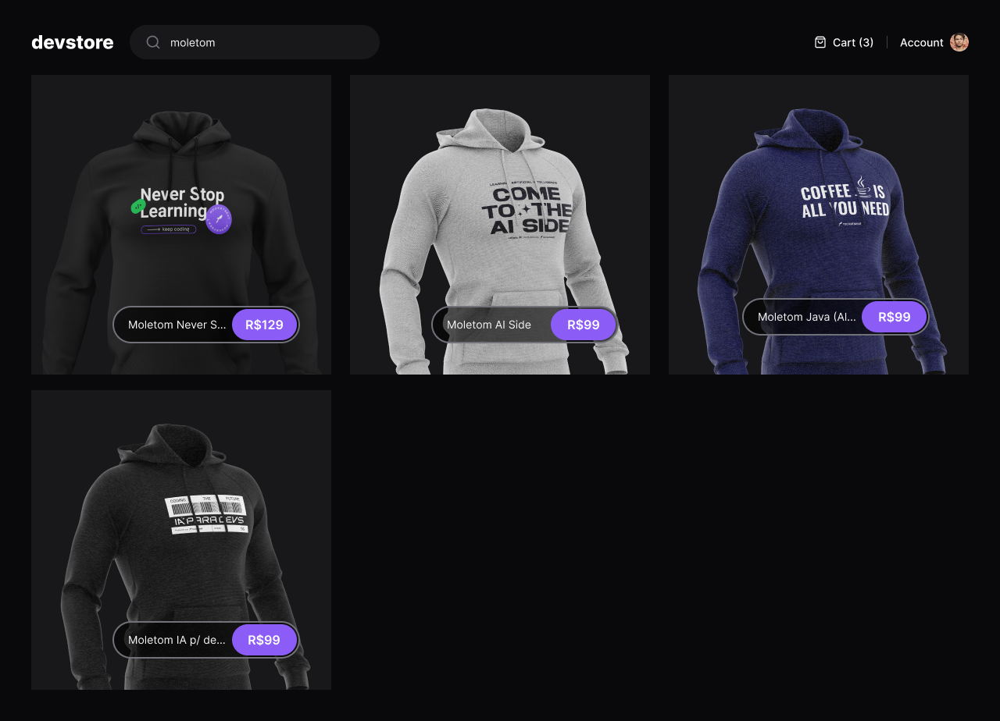
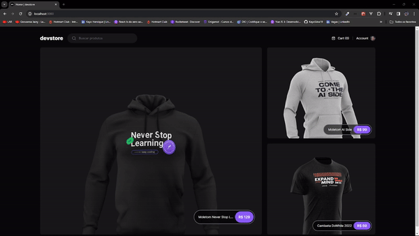

 Status: Completo 🚀

## DevStore
O DevStore é e-commerce desenvolvido utilizando Next.js e Tailwind CSS, que oferece páginas para a home, detalhes do produto e busca de produtos.

## Funcionalidades:
 * Home com produtos destaque
 * Detalhes do produto
 * Busca de produtos

<hr/>
<br/>

<center>
 <div> </div>
<br/>
<div></div>
</center>
<br/>
<hr/>

## Tecnologias Utilizadas:

 * Next
 * TailwindCSS
 * Lucide React
 * prettier plugin tailwindcss
 * typescript
 * tailwind merge
 * cypress
 * eslint

<br/>
<hr/>

 ## Demonstração:
 
<div>
    
</div>

## Instalação
  * Faça um clone do repositório do projeto no GitHub.
  * Navegue até o diretório do projeto.
  * Execute o seguinte comando para instalar as dependências:

```
$ pnpm install
```

## Running the project
```
$ pnpm run dev
```


